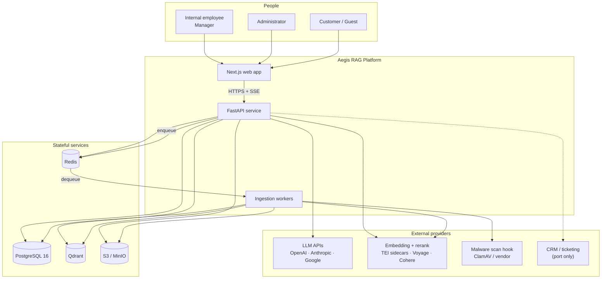
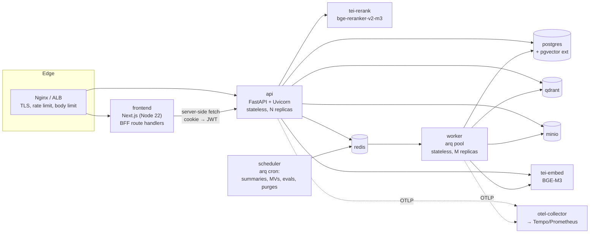
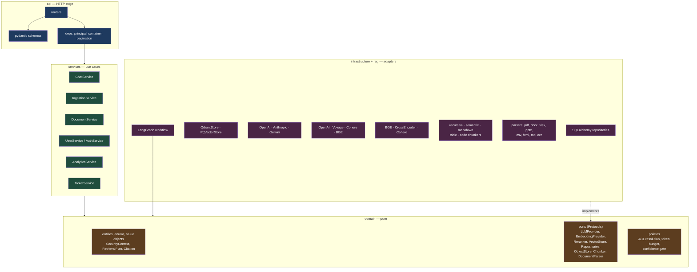
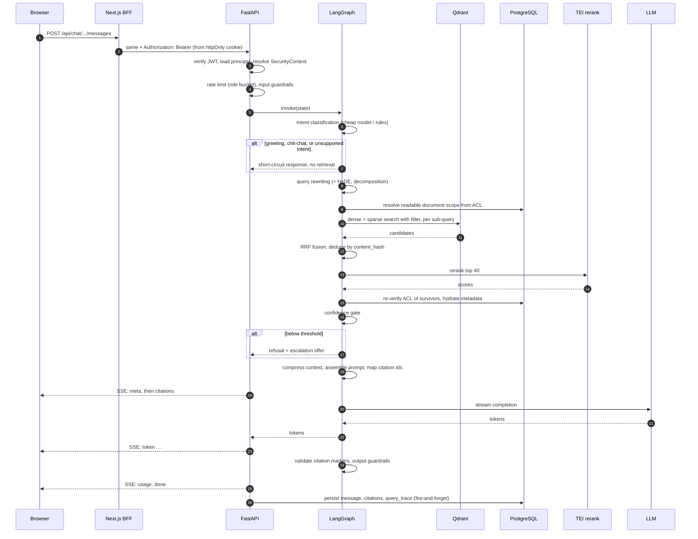
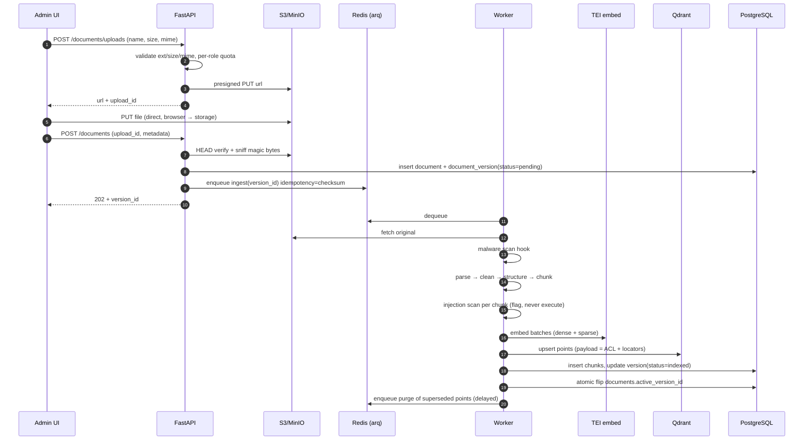

# 01 — System Architecture

## 1. What the system must guarantee

Functional requirements are cheap to list; the guarantees are what shape the architecture. Four
of them drive nearly every decision in this document.

**G1 — Groundedness.** Every assistant sentence that asserts a fact must be traceable to a
retrieved chunk. Enforced by a prompt contract that requires inline markers, a post-generation
validator that rejects markers pointing at chunks not in context, and a confidence gate that
refuses before generation when retrieval is weak. A "helpful" answer with no source is a defect,
equal in severity to a 500.

**G2 — Permission correctness.** A principal must never see content they are not entitled to,
including indirectly through a summary. Enforced before retrieval, not after generation, and
verified twice (vector-store pre-filter, then PostgreSQL re-check). Any ACL bug is a P0.

**G3 — Explainability.** For any answer, an operator must be able to reconstruct exactly what
happened: the rewritten queries, the filter applied, every candidate with dense/sparse/rerank
scores, the compressed context, the model, the tokens, and the latency of each stage. Stored in
`query_traces` on every request, not only on error.

**G4 — Provider independence.** LLM, embedding model, reranker, and vector store are
replaceable without touching domain code. Model markets move faster than release cycles.

### Service level objectives

| Metric | Objective | Measurement point |
|---|---|---|
| Time to first token (p95) | ≤ 2.5 s | Request received → first SSE `token` event |
| Time to citations (p95) | ≤ 1.8 s | Citations are emitted before generation starts |
| Full answer (p95) | ≤ 9 s | Request → SSE `done` |
| Retrieval stage (p95) | ≤ 550 ms | Hybrid search + fusion |
| Rerank stage (p95) | ≤ 350 ms | 40 candidates, local BGE-reranker-v2-m3 on TEI |
| API availability | 99.9 % monthly | Excludes upstream LLM outages, which degrade to a stated error |
| Ingestion throughput | ≥ 40 pages/min/worker (text), ≥ 6 pages/min/worker (OCR) | Job start → indexed |
| Retrieval recall@20 on golden set | ≥ 0.90 | CI gate, blocks deploy |
| Faithfulness (Ragas) | ≥ 0.92 | CI gate, blocks deploy |
| Unsupported-claim rate | ≤ 1 % | Nightly judge over sampled production traces |

### Capacity model

Sized from the assumptions in the README (10M chunks, 200 concurrent chats, 50k questions/day).

- **Vectors:** 10M × 3072 dims × 4 bytes ≈ 123 GB raw. Qdrant is configured with scalar (int8)
  quantization and on-disk payloads → ~31 GB resident plus HNSW graph overhead, comfortable on a
  64 GB node. This is precisely why quantization is a launch decision and not an optimization:
  the un-quantized footprint changes the machine class.
- **Concurrency:** an in-flight chat holds one asyncio task and one LLM socket, not a thread. At
  200 concurrent streams the API is I/O-bound; 4 Uvicorn workers × 2 vCPU handles it, with the
  connection pool (20 + 10 overflow per worker) as the real ceiling — PostgreSQL sees ≤ 120
  connections, so PgBouncer in transaction mode is required beyond 8 API workers.
- **Peak QPS:** 50k/day with a 6× business-hours peaking factor ≈ 3.5 QPS sustained, 10 QPS
  burst. Not a throughput problem; a tail-latency problem. Every stage therefore has its own
  timeout and its own metric.

---

## 2. Context view

Two properties of this view matter. First, the **frontend never talks to a provider or a
datastore** — no API key ever reaches the browser, and the browser holds no bearer token
(see §6). Second, **ingestion is out-of-band**. Upload returns `202` immediately; parsing, OCR,
chunking, and embedding happen in workers. A 400-page scanned PDF cannot occupy an HTTP request
or degrade chat latency.

---

## 3. Container view

Why these boundaries:

- **`api` and `worker` share one codebase, one image, different entrypoints.** They share the
  domain, the repositories, the chunkers, and the embedding adapters. Splitting them into
  separate repos would duplicate the ingestion domain in two places and guarantee drift. They
  scale independently because ingestion is CPU/memory-heavy and bursty while chat is I/O-heavy
  and steady — co-locating them would let one 500 MB PDF parse cause chat GC pauses.
- **TEI sidecars instead of in-process models.** Loading BGE-M3 and a cross-encoder into the API
  process would add ~4 GB RSS per replica, make cold start ~40 s, pin ML wheels into the API
  image, and burn GIL time on CPU inference inside an async event loop — the single worst thing
  you can do to tail latency in asyncio. As HTTP sidecars they batch requests across replicas,
  scale on their own, and can move to GPU nodes with a URL change.
- **`scheduler` is separate from `worker`** so that cron jobs (conversation summarization,
  materialized view refresh, nightly evals, version purges) are not starved by a queue backlog,
  and so exactly one scheduler runs regardless of worker replica count.
- **Next.js acts as a BFF.** Its route handlers hold the httpOnly cookie, attach the JWT
  server-side, and proxy `/api/*` to FastAPI. This is what lets us keep tokens out of JS.

---

## 4. Backend component view

Ports-and-adapters (hexagonal) with four layers and one dependency rule: **inward only**.

The `domain` package imports nothing but the standard library and Pydantic. It does not know
that PostgreSQL, Qdrant, or OpenAI exist. Consequences that pay for themselves:

- `ChatService` is unit-testable with in-memory fakes — no Docker, no network, milliseconds. This
  is what makes the prompt-injection and RBAC test suites (dozens of cases each) fast enough to
  run on every commit.
- Swapping Qdrant for pgvector is one line in the container factory, because both satisfy the
  same `VectorStore` protocol including its filter algebra.
- The reranker can be disabled (`NoopReranker`) for a load test without an `if` statement in the
  pipeline.

### Dependency injection

A single `Container` is built once in the FastAPI `lifespan`, holding long-lived clients
(engine, Qdrant client, Redis pool, HTTP client with connection reuse) and factory functions for
per-request services. Routers depend on `Annotated[ChatService, Depends(get_chat_service)]`.

Rejected: `dependency-injector` and similar frameworks. They add a metaprogramming layer, wire
configuration in a DSL, and interact awkwardly with FastAPI's own `Depends` graph. An explicit
container is ~150 lines, is trivially greppable, and gives full type inference. Rejected also:
module-level singletons — they make tests order-dependent and event-loop-bound.

---

## 5. Request lifecycle — chat

Three deliberate choices are visible here.

**Citations are emitted before the first token.** Retrieval has already completed, so the UI can
render the source panel while prose streams in. It also means a client that disconnects
mid-stream still logged which documents were consulted.

**The ACL is consulted twice** (steps 9 and 15). The pre-filter is what makes retrieval correct
and fast; the post-check is what makes it *safe* when the vector payload is stale — a document
whose visibility was tightened one second ago may still carry the old payload until reindex
completes. PostgreSQL is the source of truth, so survivors are re-verified against it.

**Persistence is off the critical path.** Trace writes go to a bounded queue drained by a
background task. If the queue is full we drop traces and increment a counter rather than slow
the answer — but the `messages` row itself is written transactionally, because conversation
history is user-visible state, not telemetry.

## Request lifecycle — ingestion

The upload bypasses the API process entirely via a presigned URL. A 500 MB file therefore never
occupies API memory or a request slot; the API only validates intent and verifies the object
afterwards. Content-type is decided by **magic-byte sniffing**, never by the client-declared
`Content-Type` header — that header is attacker-controlled.

---

## 6. Cross-cutting concerns

| Concern | Mechanism |
|---|---|
| Configuration | `pydantic-settings`, one frozen `Settings` object, fail-fast validation at boot. No `os.getenv` outside `core/config.py`. |
| Secrets | Env vars locally; `SecretsProvider` port with AWS Secrets Manager / Vault adapters. Secrets are `SecretStr`, redacted in logs and tracebacks. |
| Correlation | `X-Request-ID` accepted or generated, bound into a `contextvar`, present on every log line, propagated to workers through the job payload, returned in the response header. |
| Logging | `structlog`, JSON, one event per stage with duration; a redaction processor strips secrets/PII by key and pattern. |
| Tracing | OpenTelemetry auto-instrumentation for FastAPI/SQLAlchemy/httpx plus manual spans per pipeline stage; `trace_id` stored on `query_traces` to jump from a bad answer to its trace. |
| Metrics | Prometheus at `/metrics`: per-stage histograms, retrieval score distributions, no-answer rate, token/cost counters by model and role, queue depth and job age. |
| Errors | Domain exceptions → RFC 9457 `application/problem+json`. Never leak stack traces, SQL, or provider payloads. |
| Idempotency | `Idempotency-Key` on mutating endpoints, Redis-backed; ingestion keyed on content checksum so a re-upload of identical bytes is a no-op. |
| Resilience | Per-provider timeouts, bounded retries with jitter on 429/5xx only, circuit breaker per provider, and an ordered fallback chain (`gpt-5.x → claude → gemini`) that is recorded in the trace. |
| Migrations | Alembic, autogenerate-reviewed-by-hand, forward-only in production, additive-then-backfill-then-drop for column removals. |

---

## 7. Key decisions, alternatives, tradeoffs

### LangGraph for orchestration, LlamaIndex for ingestion

**Chosen** because the retrieval flow is a graph with real branches — clarify, refuse, escalate,
short-circuit — and LangGraph makes those edges explicit, typed, individually testable, and
checkpointable. LlamaIndex is used where it is strongest: `SimpleDirectoryReader`-family readers,
`MarkdownNodeParser`, `SemanticSplitterNodeParser`, and table extraction.

**Alternatives.** (a) Hand-rolled orchestration: fewer dependencies and total control, but we
would reimplement state reduction, streaming plumbing, and checkpointing, and lose the ability to
visualize the graph. (b) LlamaIndex query engines end-to-end: fastest to a demo, but the branch
logic ends up inside callbacks and response synthesizers, which is where explainability goes to
die. (c) A LangChain agent with tools: the LLM decides control flow, which is exactly the
non-determinism an audited enterprise flow cannot have.

**Tradeoff accepted.** Two AI frameworks in `requirements`. Mitigated by confining LlamaIndex
imports to `rag/parsing` and `rag/chunking` behind the `DocumentParser`/`Chunker` ports, and
LangGraph to `agents/`. Neither type appears in `domain` or `services`.

### Qdrant default, pgvector alternative

**Chosen** because Qdrant supports named dense *and* sparse vectors on the same point with
server-side RRF/DBSF fusion, rich filtering with payload indexes (needed for ACL pre-filtering at
10M scale), int8 quantization, and on-disk payloads. Hybrid search becomes one round trip instead
of two systems plus client-side merging.

**Alternatives.** pgvector keeps everything in one database — one backup, one transaction, no
dual-write consistency problem, and it is the right choice below ~2M chunks or where ops will not
run another stateful service. Its costs at our target scale: HNSW index builds are slow and
memory-hungry, filtered ANN degrades (the filter is applied post-scan unless the planner
cooperates), and BM25 must come from `tsvector` with fusion in Python. Elasticsearch/OpenSearch
would give best-in-class BM25 but a heavier operational footprint and weaker ANN ergonomics.
Pinecone/Weaviate are viable; Pinecone is managed-only (data residency) and Weaviate overlaps
Qdrant without a decisive win.

**Tradeoff accepted.** Two stores means PostgreSQL and Qdrant can disagree. Addressed by making
PostgreSQL authoritative, treating Qdrant as a rebuildable derived index, storing
`vector_point_id` and `indexed_at` on `chunks`, and running a nightly reconciliation job that
reports and repairs drift.

### SSE, not WebSocket

Chat streaming is unidirectional server→client after the request. SSE is plain HTTP: it works
through corporate proxies and ALBs, survives HTTP/2 multiplexing, reconnects natively, needs no
sticky sessions, and keeps the endpoint a normal authenticated `POST` covered by the same
middleware as everything else. WebSocket would add a second auth path, a second rate-limit
implementation, and stateful connections that complicate horizontal scaling — for a feature we do
not need (there is no client→server mid-stream traffic beyond cancel, which is a plain `DELETE`).

### Async everywhere, with an explicit escape hatch

All I/O is `async` (asyncpg, httpx, redis.asyncio, qdrant async client). Truly CPU-bound work —
PDF parsing, OCR, tokenizer-heavy chunk sizing — runs in **workers**, and where it must run
in-process it goes through `anyio.to_thread.run_sync` with a bounded limiter. A blocking call on
the event loop stalls all 200 concurrent streams, so `blockbuster` runs in the test suite to fail
the build when a sync call sneaks into an async path.

### Performance considerations

Latency is dominated by two things: the LLM (unavoidable, mitigated by streaming and by keeping
the prompt small) and everything we do before it (avoidable). Countermeasures designed in:
parallel `asyncio.gather` over sub-queries; a shared HTTP client with keep-alive to every
provider; two cache tiers (embedding cache keyed on `sha256(text)+model`, and an answer cache
keyed on `normalized_query + filter_hash + corpus_version` with short TTL, never crossing a
`SecurityContext` boundary); `top_k` and rerank depth as config, not constants; payload indexes
on every filterable field; and a hard token budget so context length cannot silently grow.

### Security considerations

Enumerated in document 06. Architecturally: the browser holds no token; retrieved content is
labelled untrusted data and never concatenated into the instruction region; uploads go to
isolated storage and are sniffed and scanned; every mutation writes an append-only audit row; and
the customer-mode visibility ceiling is a server-side constant that no request field can raise.

### Scaling considerations

`api` and `worker` are stateless — scale horizontally, with PgBouncer once workers exceed the
connection budget. Redis is the only shared coordination point (queue, rate limits, idempotency)
and moves to a managed cluster. Qdrant scales by sharding a collection with replication ≥ 2.
PostgreSQL scales by partitioning the hot append-only tables (`query_traces`, `audit_logs`)
monthly and adding read replicas for analytics; the dashboard reads materialized views, never
raw traces. Growth beyond a single Qdrant collection is handled by collection-per-embedding-model
routing, which the `collections` table already models — a model upgrade becomes: create a new
collection, backfill in workers, shadow-evaluate, flip.
