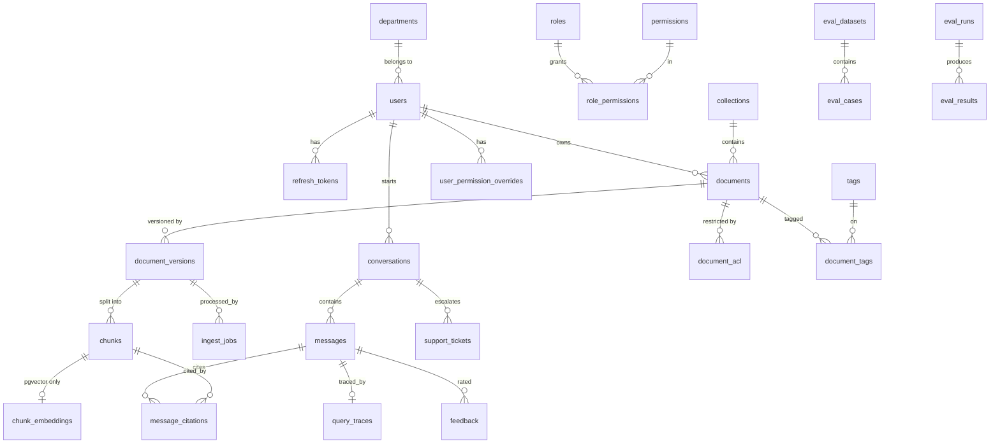

# 03 — Database Schema

PostgreSQL 16 is the **source of truth** for identity, permissions, documents, chunk text,
conversations, citations, and telemetry. Qdrant holds only derived vectors plus the payload needed
to pre-filter them, and can be rebuilt from PostgreSQL at any time.

Conventions: `uuid` v7 primary keys (time-ordered, so B-tree inserts stay at the right edge and
index bloat stays low, unlike v4); `timestamptz` everywhere, UTC only; `created_at`/`updated_at`
on mutable tables; soft delete (`deleted_at`) only where references must survive; `citext` for
emails; `jsonb` for genuinely open-ended payloads and never as a substitute for a column that
will be filtered.

---

## 1. Entity relationships



---

## 2. Enumerated types

```sql
CREATE TYPE user_role       AS ENUM ('admin','manager','internal_employee','customer','guest');
CREATE TYPE visibility      AS ENUM ('public','customer','internal','confidential','restricted');
CREATE TYPE assistant_mode  AS ENUM ('internal','customer');
CREATE TYPE chunk_type      AS ENUM ('text','heading','table','code','list','caption','form','ocr');
CREATE TYPE ingest_status   AS ENUM ('pending','scanning','parsing','chunking','embedding',
                                     'indexing','indexed','failed','quarantined','superseded');
CREATE TYPE job_status      AS ENUM ('queued','running','succeeded','failed','dead');
CREATE TYPE message_role    AS ENUM ('user','assistant','system');
CREATE TYPE answer_status   AS ENUM ('ok','no_answer','refused','clarify','escalated','error');
CREATE TYPE principal_type  AS ENUM ('role','user','department');
CREATE TYPE ticket_priority AS ENUM ('low','normal','high','urgent');
CREATE TYPE ticket_status   AS ENUM ('open','in_progress','waiting_customer','resolved','closed');
CREATE TYPE feedback_rating AS ENUM ('up','down');
CREATE TYPE eval_metric     AS ENUM ('faithfulness','answer_relevancy','context_precision',
                                     'context_recall','citation_correctness','answer_correctness');
```

### The visibility lattice

Ordered, and the order is what makes ACL filtering fast:

| Level | Value | Who may read |
|---|---|---|
| 0 | `public` | anyone, including unauthenticated guests |
| 1 | `customer` | any authenticated principal (customer-facing knowledge base) |
| 2 | `internal` | `internal_employee`, `manager`, `admin` — internal mode only |
| 3 | `confidential` | `manager`, `admin`, and only within the owning department subtree |
| 4 | `restricted` | nobody by level; requires an explicit `document_acl` grant |

Because it is a total order, the hot filter becomes a **range predicate**
(`visibility_level <= ceiling`) rather than set membership over N enum values — one integer
comparison per candidate inside Qdrant, and a `btree` range scan in PostgreSQL. The denormalized
`visibility_level smallint` is therefore stored on `documents`, on `chunks`, and in the Qdrant
payload. It is maintained by trigger from the `visibility` enum so the two can never disagree.

---

## 3. Identity, roles, permissions

```sql
CREATE TABLE departments (
    id           uuid PRIMARY KEY,
    name         text NOT NULL,
    slug         citext NOT NULL UNIQUE,
    parent_id    uuid REFERENCES departments(id) ON DELETE SET NULL,
    path         ltree NOT NULL,             -- e.g. 'company.finance.payroll'
    created_at   timestamptz NOT NULL DEFAULT now()
);
CREATE INDEX ix_departments_path ON departments USING gist (path);

CREATE TABLE users (
    id                uuid PRIMARY KEY,
    email             citext NOT NULL UNIQUE,
    password_hash     text,                  -- NULL for SSO-only and guest principals
    full_name         text NOT NULL,
    role              user_role NOT NULL,
    department_id     uuid REFERENCES departments(id) ON DELETE SET NULL,
    is_active         boolean NOT NULL DEFAULT true,
    must_change_password boolean NOT NULL DEFAULT false,
    mfa_secret        text,
    external_idp_sub  text UNIQUE,           -- OIDC subject, for the SSO hook
    failed_logins     smallint NOT NULL DEFAULT 0,
    locked_until      timestamptz,
    last_login_at     timestamptz,
    created_at        timestamptz NOT NULL DEFAULT now(),
    updated_at        timestamptz NOT NULL DEFAULT now(),
    deleted_at        timestamptz
);
CREATE INDEX ix_users_role_active ON users(role) WHERE deleted_at IS NULL AND is_active;
CREATE INDEX ix_users_department  ON users(department_id) WHERE deleted_at IS NULL;

CREATE TABLE permissions (
    code        text PRIMARY KEY,            -- 'document:write', 'analytics:read', …
    description text NOT NULL,
    category    text NOT NULL
);

CREATE TABLE role_permissions (
    role            user_role NOT NULL,
    permission_code text NOT NULL REFERENCES permissions(code) ON DELETE CASCADE,
    PRIMARY KEY (role, permission_code)
);

-- Per-user exceptions: grant a permission above the role, or revoke one from it.
CREATE TABLE user_permission_overrides (
    user_id         uuid NOT NULL REFERENCES users(id) ON DELETE CASCADE,
    permission_code text NOT NULL REFERENCES permissions(code) ON DELETE CASCADE,
    effect          text NOT NULL CHECK (effect IN ('allow','deny')),
    granted_by      uuid REFERENCES users(id),
    expires_at      timestamptz,
    created_at      timestamptz NOT NULL DEFAULT now(),
    PRIMARY KEY (user_id, permission_code)
);

CREATE TABLE refresh_tokens (
    id          uuid PRIMARY KEY,
    user_id     uuid NOT NULL REFERENCES users(id) ON DELETE CASCADE,
    jti         uuid NOT NULL UNIQUE,
    token_hash  bytea NOT NULL,              -- sha256 of the token; the token is never stored
    family_id   uuid NOT NULL,               -- rotation lineage; reuse revokes the whole family
    expires_at  timestamptz NOT NULL,
    revoked_at  timestamptz,
    user_agent  text,
    ip          inet,
    created_at  timestamptz NOT NULL DEFAULT now()
);
CREATE INDEX ix_refresh_active ON refresh_tokens(user_id) WHERE revoked_at IS NULL;
CREATE INDEX ix_refresh_family ON refresh_tokens(family_id);

CREATE TABLE api_keys (
    id          uuid PRIMARY KEY,
    name        text NOT NULL,
    prefix      char(8) NOT NULL UNIQUE,     -- shown in the UI for identification
    key_hash    bytea NOT NULL,
    role        user_role NOT NULL,
    scopes      text[] NOT NULL DEFAULT '{}',
    created_by  uuid REFERENCES users(id),
    last_used_at timestamptz,
    expires_at  timestamptz,
    revoked_at  timestamptz,
    created_at  timestamptz NOT NULL DEFAULT now()
);
```

**Why both a coarse `role` enum and a fine `permissions` table.** The role enum drives retrieval
(the visibility ceiling — a small closed set that must be fast and auditable), while permissions
drive *administrative* capability (who may reindex, who may see analytics, who may edit ACLs).
Collapsing them into one model gives either an unbounded set in the hot retrieval filter or an
inflexible admin panel. Overrides exist because in every real deployment someone needs
`document:write` without being a manager, and the alternative is inventing fake roles.

**Refresh-token families** implement rotation-with-reuse-detection: each refresh mints a new token
in the same family and revokes the old `jti`; presenting an already-used `jti` means the token
leaked, so the entire family is revoked and the user is forced to re-authenticate.

---

## 4. Collections and documents

```sql
CREATE TABLE collections (
    id                uuid PRIMARY KEY,
    name              text NOT NULL,
    slug              citext NOT NULL UNIQUE,
    description       text,
    mode              assistant_mode NOT NULL,     -- which assistant may read it
    default_visibility visibility NOT NULL DEFAULT 'internal',
    embedding_provider text NOT NULL,              -- 'openai' | 'voyage' | 'cohere' | 'bge'
    embedding_model    text NOT NULL,
    embedding_dim      integer NOT NULL,
    vector_backend     text NOT NULL DEFAULT 'qdrant',
    vector_namespace   text NOT NULL,              -- Qdrant collection name
    chunk_strategy     text NOT NULL DEFAULT 'adaptive',
    chunk_size         integer NOT NULL DEFAULT 800,
    chunk_overlap      integer NOT NULL DEFAULT 120,
    is_active          boolean NOT NULL DEFAULT true,
    created_at         timestamptz NOT NULL DEFAULT now(),
    updated_at         timestamptz NOT NULL DEFAULT now()
);

CREATE TABLE documents (
    id                uuid PRIMARY KEY,
    collection_id     uuid NOT NULL REFERENCES collections(id) ON DELETE RESTRICT,
    title             text NOT NULL,
    description       text,
    source_type       text NOT NULL,               -- 'upload' | 'url' | 'connector'
    source_ref        text,
    visibility        visibility NOT NULL,
    visibility_level  smallint NOT NULL,           -- trigger-maintained from visibility
    department_id     uuid REFERENCES departments(id) ON DELETE SET NULL,
    department_path   ltree,                       -- denormalized for subtree filtering
    language          char(2),
    owner_id          uuid REFERENCES users(id) ON DELETE SET NULL,
    active_version_id uuid,                        -- FK added after document_versions exists
    effective_from    date,
    expires_at        date,                        -- excluded from retrieval once past
    is_archived       boolean NOT NULL DEFAULT false,
    created_at        timestamptz NOT NULL DEFAULT now(),
    updated_at        timestamptz NOT NULL DEFAULT now(),
    deleted_at        timestamptz
);
CREATE INDEX ix_documents_retrievable ON documents(collection_id, visibility_level)
    WHERE deleted_at IS NULL AND NOT is_archived AND active_version_id IS NOT NULL;
CREATE INDEX ix_documents_dept  ON documents USING gist (department_path);
CREATE INDEX ix_documents_title ON documents USING gin (title gin_trgm_ops);

CREATE TABLE document_versions (
    id              uuid PRIMARY KEY,
    document_id     uuid NOT NULL REFERENCES documents(id) ON DELETE CASCADE,
    version_no      integer NOT NULL,
    storage_uri     text NOT NULL,                 -- s3://bucket/key
    original_filename text NOT NULL,
    mime_type       text NOT NULL,                 -- sniffed, not client-declared
    size_bytes      bigint NOT NULL,
    checksum_sha256 bytea NOT NULL,
    page_count      integer,
    extracted_chars integer,
    used_ocr        boolean NOT NULL DEFAULT false,
    parser          text,
    chunk_strategy  text,
    embedding_model text,
    chunk_count     integer NOT NULL DEFAULT 0,
    token_count     integer NOT NULL DEFAULT 0,
    status          ingest_status NOT NULL DEFAULT 'pending',
    error_message   text,
    injection_flags integer NOT NULL DEFAULT 0,    -- chunks that tripped the scanner
    change_note     text,
    created_by      uuid REFERENCES users(id),
    created_at      timestamptz NOT NULL DEFAULT now(),
    indexed_at      timestamptz,
    superseded_at   timestamptz,
    UNIQUE (document_id, version_no),
    UNIQUE (document_id, checksum_sha256)          -- re-uploading identical bytes is a no-op
);
ALTER TABLE documents ADD CONSTRAINT fk_documents_active_version
    FOREIGN KEY (active_version_id) REFERENCES document_versions(id) ON DELETE SET NULL;

CREATE TABLE tags (
    id    uuid PRIMARY KEY,
    name  citext NOT NULL UNIQUE,
    color text
);
CREATE TABLE document_tags (
    document_id uuid NOT NULL REFERENCES documents(id) ON DELETE CASCADE,
    tag_id      uuid NOT NULL REFERENCES tags(id) ON DELETE CASCADE,
    PRIMARY KEY (document_id, tag_id)
);

CREATE TABLE document_acl (
    id             uuid PRIMARY KEY,
    document_id    uuid NOT NULL REFERENCES documents(id) ON DELETE CASCADE,
    principal_type principal_type NOT NULL,
    principal_role user_role,                      -- when principal_type='role'
    principal_id   uuid,                           -- user or department id otherwise
    include_subtree boolean NOT NULL DEFAULT true, -- departments only
    granted_by     uuid REFERENCES users(id),
    expires_at     timestamptz,
    created_at     timestamptz NOT NULL DEFAULT now(),
    CHECK ((principal_type = 'role' AND principal_role IS NOT NULL AND principal_id IS NULL)
        OR (principal_type <> 'role' AND principal_id IS NOT NULL AND principal_role IS NULL))
);
CREATE INDEX ix_acl_document ON document_acl(document_id);
CREATE INDEX ix_acl_user     ON document_acl(principal_id) WHERE principal_type = 'user';
```

### The versioning model, and why citations survive a replacement

A `document` is a stable identity; a `document_version` is immutable content. Replacing a document
inserts version *n+1*, ingests it fully in the background, and only then flips
`documents.active_version_id` in a single statement. Until the flip, retrieval keeps serving
version *n* — there is no window where a document is unsearchable, and a failed ingest leaves
production untouched (`status='failed'` on the new row, no flip).

Old versions are marked `superseded` but are **not** deleted immediately, and `chunks` rows are
never hard-deleted while a `message_citations` row references them. A citation from six months ago
therefore still resolves to the exact text the model actually saw — which is the entire point of
citing, and the property naive "delete and re-upload" designs lose. The purge job (nightly) drops
vectors for superseded versions right away (they must not be retrievable) but keeps the *rows*
until they are both older than the retention window and unreferenced.

```
documents.active_version_id ──► v3 (indexed)   ← retrieval reads this
                                v2 (superseded) ← chunks retained, vectors purged
                                v1 (superseded) ← retained only if cited
```

---

## 5. Chunks

```sql
CREATE TABLE chunks (
    id               uuid PRIMARY KEY,
    document_id      uuid NOT NULL REFERENCES documents(id) ON DELETE CASCADE,
    version_id       uuid NOT NULL REFERENCES document_versions(id) ON DELETE CASCADE,
    collection_id    uuid NOT NULL REFERENCES collections(id) ON DELETE RESTRICT,
    ordinal          integer NOT NULL,
    content          text NOT NULL,
    content_hash     bytea NOT NULL,               -- sha256, for cross-document dedupe
    token_count      integer NOT NULL,
    chunk_type       chunk_type NOT NULL DEFAULT 'text',
    -- locators, all of which appear in a citation
    page_from        integer,
    page_to          integer,
    heading_path     text[],                       -- ['Benefits','Leave','Parental leave']
    section          text,
    char_start       integer,
    char_end         integer,
    bbox             jsonb,                        -- PDF highlight rectangles when available
    -- retrieval aids
    context_header   text,                         -- prepended at embed time (see doc 05)
    summary          text,                         -- for table/code chunks
    keywords         text[],
    language         char(2),
    -- denormalized ACL, kept in sync by trigger from documents
    visibility_level smallint NOT NULL,
    department_path  ltree,
    -- vector bookkeeping
    vector_point_id  uuid,
    embedding_model  text,
    indexed_at       timestamptz,
    injection_flag   boolean NOT NULL DEFAULT false,
    metadata         jsonb NOT NULL DEFAULT '{}',
    tsv              tsvector GENERATED ALWAYS AS (
                        to_tsvector('english', coalesce(content,''))) STORED,
    created_at       timestamptz NOT NULL DEFAULT now(),
    UNIQUE (version_id, ordinal)
);
CREATE INDEX ix_chunks_tsv        ON chunks USING gin (tsv);
CREATE INDEX ix_chunks_version    ON chunks(version_id);
CREATE INDEX ix_chunks_doc        ON chunks(document_id);
CREATE INDEX ix_chunks_hash       ON chunks(content_hash);
CREATE INDEX ix_chunks_unindexed  ON chunks(collection_id) WHERE indexed_at IS NULL;
CREATE INDEX ix_chunks_keywords   ON chunks USING gin (keywords);

-- Created only when vector_backend='pgvector'; kept separate so the base schema
-- carries no 12 KB-per-row column when Qdrant is in use.
CREATE TABLE chunk_embeddings (
    chunk_id  uuid PRIMARY KEY REFERENCES chunks(id) ON DELETE CASCADE,
    model     text NOT NULL,
    embedding vector(3072) NOT NULL
);
CREATE INDEX ix_chunk_emb_hnsw ON chunk_embeddings
    USING hnsw (embedding vector_cosine_ops) WITH (m = 16, ef_construction = 200);
```

`chunks.content` is stored in PostgreSQL rather than only in the vector payload for three reasons:
BM25 needs `tsvector`; the citation drawer needs exact text with offsets to highlight; and the
index must be rebuildable without re-parsing originals — a reindex after an embedding-model
upgrade reads `chunks`, never S3.

`visibility_level` and `department_path` are duplicated onto `chunks` (and into the Qdrant payload)
because ACL filtering must happen *inside* the search, not as a join afterwards. The duplication is
trigger-maintained, and the nightly reconciliation job verifies it.

---

## 6. Conversations, messages, citations

```sql
CREATE TABLE conversations (
    id              uuid PRIMARY KEY,
    user_id         uuid REFERENCES users(id) ON DELETE SET NULL,  -- NULL for guests
    guest_session_id text,
    mode            assistant_mode NOT NULL,
    collection_ids  uuid[] NOT NULL DEFAULT '{}',   -- empty = all permitted for the mode
    title           text,
    summary         text,                            -- rolling summary, see doc 05 §6
    summary_upto_message_id uuid,
    message_count   integer NOT NULL DEFAULT 0,
    total_tokens    integer NOT NULL DEFAULT 0,
    is_pinned       boolean NOT NULL DEFAULT false,
    is_archived     boolean NOT NULL DEFAULT false,
    created_at      timestamptz NOT NULL DEFAULT now(),
    last_message_at timestamptz,
    deleted_at      timestamptz
);
CREATE INDEX ix_conv_user ON conversations(user_id, last_message_at DESC)
    WHERE deleted_at IS NULL;
CREATE INDEX ix_conv_guest ON conversations(guest_session_id) WHERE guest_session_id IS NOT NULL;

CREATE TABLE messages (
    id                uuid PRIMARY KEY,
    conversation_id   uuid NOT NULL REFERENCES conversations(id) ON DELETE CASCADE,
    parent_id         uuid REFERENCES messages(id) ON DELETE SET NULL,  -- regenerate branches
    role              message_role NOT NULL,
    content           text NOT NULL,
    status            answer_status,                 -- assistant messages only
    refusal_reason    text,
    model             text,
    provider          text,
    prompt_tokens     integer,
    completion_tokens integer,
    cost_usd          numeric(12,6),
    latency_ms        integer,
    ttft_ms           integer,
    confidence        real,                          -- 0..1, from the confidence gate
    is_grounded       boolean,
    finish_reason     text,
    created_at        timestamptz NOT NULL DEFAULT now(),
    edited_at         timestamptz
);
CREATE INDEX ix_messages_conv ON messages(conversation_id, created_at);

CREATE TABLE message_citations (
    id            uuid PRIMARY KEY,
    message_id    uuid NOT NULL REFERENCES messages(id) ON DELETE CASCADE,
    chunk_id      uuid NOT NULL REFERENCES chunks(id) ON DELETE RESTRICT,  -- keeps history honest
    document_id   uuid NOT NULL REFERENCES documents(id) ON DELETE RESTRICT,
    version_id    uuid NOT NULL REFERENCES document_versions(id) ON DELETE RESTRICT,
    marker        smallint NOT NULL,                 -- the [^1] the model emitted
    rank          smallint NOT NULL,                 -- position in the reranked context
    quote         text,                              -- exact supporting span
    quote_start   integer,
    quote_end     integer,
    page          integer,
    score_dense   real,
    score_sparse  real,
    score_fused   real,
    score_rerank  real,
    was_used      boolean NOT NULL DEFAULT true,     -- false = retrieved but uncited
    UNIQUE (message_id, marker)
);
CREATE INDEX ix_citations_chunk ON message_citations(chunk_id);
CREATE INDEX ix_citations_doc   ON message_citations(document_id);

CREATE TABLE feedback (
    id         uuid PRIMARY KEY,
    message_id uuid NOT NULL REFERENCES messages(id) ON DELETE CASCADE,
    user_id    uuid REFERENCES users(id) ON DELETE SET NULL,
    rating     feedback_rating NOT NULL,
    reason     text,                                 -- 'wrong','incomplete','not_cited',…
    comment    text,
    created_at timestamptz NOT NULL DEFAULT now(),
    UNIQUE (message_id, user_id)
);
```

`ON DELETE RESTRICT` on `message_citations.chunk_id` is deliberate and load-bearing: it makes it
*impossible* to delete a chunk that a stored answer cites. Deleting a document therefore soft-
deletes and purges vectors, and only the retention job may remove the rows once no citation
references them. A `CASCADE` here would silently corrupt audit history.

---

## 7. Ingestion jobs and index health

```sql
CREATE TABLE ingest_jobs (
    id           uuid PRIMARY KEY,
    version_id   uuid NOT NULL REFERENCES document_versions(id) ON DELETE CASCADE,
    job_type     text NOT NULL,                   -- 'ingest' | 'reindex' | 'purge' | 'embed'
    status       job_status NOT NULL DEFAULT 'queued',
    stage        ingest_status,
    attempts     smallint NOT NULL DEFAULT 0,
    max_attempts smallint NOT NULL DEFAULT 3,
    idempotency_key text UNIQUE,
    error_message text,
    error_class  text,
    payload      jsonb NOT NULL DEFAULT '{}',
    metrics      jsonb NOT NULL DEFAULT '{}',      -- per-stage durations, page/token counts
    queued_at    timestamptz NOT NULL DEFAULT now(),
    started_at   timestamptz,
    finished_at  timestamptz,
    worker_id    text
);
CREATE INDEX ix_jobs_status ON ingest_jobs(status, queued_at);
CREATE INDEX ix_jobs_version ON ingest_jobs(version_id);

-- Detected drift between PostgreSQL and the vector store, written by the nightly reconciler.
CREATE TABLE index_discrepancies (
    id          uuid PRIMARY KEY,
    collection_id uuid NOT NULL REFERENCES collections(id) ON DELETE CASCADE,
    chunk_id    uuid,
    kind        text NOT NULL,     -- 'missing_vector','orphan_vector','acl_mismatch','dim_mismatch'
    details     jsonb NOT NULL DEFAULT '{}',
    detected_at timestamptz NOT NULL DEFAULT now(),
    repaired_at timestamptz
);
```

## 8. Escalation

```sql
CREATE TABLE support_tickets (
    id              uuid PRIMARY KEY,
    conversation_id uuid REFERENCES conversations(id) ON DELETE SET NULL,
    message_id      uuid REFERENCES messages(id) ON DELETE SET NULL,
    requester_name  text NOT NULL,
    requester_email citext NOT NULL,
    requester_phone text,
    subject         text NOT NULL,
    question        text NOT NULL,
    transcript      jsonb,                       -- snapshot; survives conversation deletion
    priority        ticket_priority NOT NULL DEFAULT 'normal',
    status          ticket_status NOT NULL DEFAULT 'open',
    assigned_to     uuid REFERENCES users(id) ON DELETE SET NULL,
    resolution      text,
    crm_provider    text,
    crm_ref         text,
    created_at      timestamptz NOT NULL DEFAULT now(),
    updated_at      timestamptz NOT NULL DEFAULT now(),
    resolved_at     timestamptz
);
CREATE INDEX ix_tickets_status ON support_tickets(status, priority, created_at DESC);

-- Transactional outbox: the ticket and its future CRM delivery commit together.
CREATE TABLE outbox_events (
    id            uuid PRIMARY KEY,
    aggregate_type text NOT NULL,
    aggregate_id  uuid NOT NULL,
    event_type    text NOT NULL,
    payload       jsonb NOT NULL,
    attempts      smallint NOT NULL DEFAULT 0,
    published_at  timestamptz,
    next_retry_at timestamptz,
    last_error    text,
    created_at    timestamptz NOT NULL DEFAULT now()
);
CREATE INDEX ix_outbox_pending ON outbox_events(next_retry_at) WHERE published_at IS NULL;
```

The outbox exists so that "ticket created" and "CRM notified" cannot diverge. Calling a CRM inside
the request transaction gives you either lost tickets (call fails after commit) or phantom tickets
(commit fails after call). The outbox row is written in the same transaction as the ticket; a
worker publishes it at-least-once with idempotency on `outbox_events.id`.

## 9. Telemetry (partitioned)

```sql
CREATE TABLE query_traces (
    id              uuid NOT NULL,
    message_id      uuid,
    conversation_id uuid,
    user_id         uuid,
    role            user_role,
    mode            assistant_mode NOT NULL,
    request_id      text NOT NULL,
    trace_id        text,                          -- OTel trace, to jump to the span tree
    raw_query       text NOT NULL,
    intent          text,
    rewritten_queries jsonb NOT NULL DEFAULT '[]',
    filter_applied  jsonb NOT NULL DEFAULT '{}',   -- the exact ACL filter used
    candidates      jsonb NOT NULL DEFAULT '[]',   -- [{chunk_id, dense, sparse, fused, rerank}]
    context_chunk_ids uuid[] NOT NULL DEFAULT '{}',
    context_tokens  integer,
    stage_latency_ms jsonb NOT NULL DEFAULT '{}',  -- {guardrail, intent, rewrite, retrieve,…}
    total_latency_ms integer,
    ttft_ms         integer,
    model           text,
    provider        text,
    fallback_used   boolean NOT NULL DEFAULT false,
    prompt_tokens   integer,
    completion_tokens integer,
    cost_usd        numeric(12,6),
    top_score       real,
    mean_top5_score real,
    answer_status   answer_status,
    confidence      real,
    guardrail_flags jsonb NOT NULL DEFAULT '{}',
    cache_hit       boolean NOT NULL DEFAULT false,
    error_class     text,
    error_message   text,
    created_at      timestamptz NOT NULL DEFAULT now(),
    PRIMARY KEY (id, created_at)
) PARTITION BY RANGE (created_at);

CREATE TABLE audit_logs (
    id            uuid NOT NULL,
    actor_id      uuid,
    actor_role    user_role,
    actor_ip      inet,
    action        text NOT NULL,                   -- 'document.replace', 'user.role_change', …
    resource_type text NOT NULL,
    resource_id   uuid,
    outcome       text NOT NULL,                   -- 'success' | 'denied' | 'error'
    before_state  jsonb,
    after_state   jsonb,
    request_id    text,
    user_agent    text,
    created_at    timestamptz NOT NULL DEFAULT now(),
    PRIMARY KEY (id, created_at)
) PARTITION BY RANGE (created_at);
CREATE INDEX ix_audit_actor    ON audit_logs(actor_id, created_at DESC);
CREATE INDEX ix_audit_resource ON audit_logs(resource_type, resource_id, created_at DESC);
```

Monthly range partitions, created ahead of time by a cron job (`pg_partman` optional). Both tables
are the highest-volume writers in the system — 50k traces/day plus every admin action — and both
are almost exclusively queried by recent time range. Partitioning makes retention a `DETACH
PARTITION` instead of a `DELETE` that would bloat the heap and thrash autovacuum, and it keeps the
analytics indexes small enough to stay in cache.

`audit_logs` has **no** `UPDATE`/`DELETE` grant for the application role — only `INSERT` and
`SELECT`, enforced at the PostgreSQL privilege level. An append-only table that the app can
rewrite is not an audit log.

## 10. Prompts, settings, evaluation

```sql
CREATE TABLE prompt_templates (
    id          uuid PRIMARY KEY,
    key         text NOT NULL,                    -- 'answer.internal', 'rewrite.multi_query', …
    version     integer NOT NULL,
    mode        assistant_mode,
    body        text NOT NULL,
    variables   text[] NOT NULL DEFAULT '{}',
    is_active   boolean NOT NULL DEFAULT false,
    notes       text,
    created_by  uuid REFERENCES users(id),
    created_at  timestamptz NOT NULL DEFAULT now(),
    UNIQUE (key, version)
);
CREATE UNIQUE INDEX ux_prompt_active ON prompt_templates(key, coalesce(mode,'internal'))
    WHERE is_active;

CREATE TABLE settings (
    key        text PRIMARY KEY,
    value      jsonb NOT NULL,
    updated_by uuid REFERENCES users(id),
    updated_at timestamptz NOT NULL DEFAULT now()
);

CREATE TABLE eval_datasets (
    id uuid PRIMARY KEY, name text NOT NULL UNIQUE, mode assistant_mode NOT NULL,
    description text, created_at timestamptz NOT NULL DEFAULT now()
);
CREATE TABLE eval_cases (
    id uuid PRIMARY KEY,
    dataset_id uuid NOT NULL REFERENCES eval_datasets(id) ON DELETE CASCADE,
    question text NOT NULL,
    ground_truth text,
    expected_document_ids uuid[] NOT NULL DEFAULT '{}',
    expected_pages integer[] NOT NULL DEFAULT '{}',
    as_role user_role NOT NULL DEFAULT 'internal_employee',
    must_refuse boolean NOT NULL DEFAULT false,     -- adversarial + out-of-corpus cases
    tags text[] NOT NULL DEFAULT '{}'
);
CREATE TABLE eval_runs (
    id uuid PRIMARY KEY,
    dataset_id uuid NOT NULL REFERENCES eval_datasets(id) ON DELETE CASCADE,
    git_sha text, config_snapshot jsonb NOT NULL DEFAULT '{}',
    status text NOT NULL DEFAULT 'running',
    summary jsonb NOT NULL DEFAULT '{}',            -- metric → mean
    started_at timestamptz NOT NULL DEFAULT now(), finished_at timestamptz,
    triggered_by uuid REFERENCES users(id)
);
CREATE TABLE eval_results (
    id uuid PRIMARY KEY,
    run_id uuid NOT NULL REFERENCES eval_runs(id) ON DELETE CASCADE,
    case_id uuid NOT NULL REFERENCES eval_cases(id) ON DELETE CASCADE,
    metric eval_metric NOT NULL,
    score real NOT NULL,
    passed boolean NOT NULL,
    answer text, retrieved_chunk_ids uuid[], detail jsonb,
    UNIQUE (run_id, case_id, metric)
);
```

Prompts live in the database, versioned, with exactly one active row per `(key, mode)`. Prompt
changes are the highest-leverage and least-reviewed change in a RAG system; versioning them means
an eval run can be pinned to a prompt version and a regression can be rolled back without a
deploy. Files under `rag/prompts/` are the seed defaults and the fallback if the table is empty.

## 11. Analytics views

Dashboards read materialized views refreshed every 5 minutes (`CONCURRENTLY`), never raw traces.

```sql
CREATE MATERIALIZED VIEW mv_query_daily AS
SELECT date_trunc('day', created_at) AS day, mode, role,
       count(*) AS queries,
       count(*) FILTER (WHERE answer_status IN ('no_answer','refused'))::numeric
         / greatest(count(*),1) AS no_answer_rate,
       percentile_cont(0.50) WITHIN GROUP (ORDER BY total_latency_ms) AS p50_ms,
       percentile_cont(0.95) WITHIN GROUP (ORDER BY total_latency_ms) AS p95_ms,
       percentile_cont(0.95) WITHIN GROUP (ORDER BY ttft_ms)          AS p95_ttft_ms,
       sum(prompt_tokens + completion_tokens) AS tokens,
       sum(cost_usd) AS cost_usd,
       avg(top_score) AS avg_top_score,
       count(DISTINCT user_id) AS active_users
FROM query_traces GROUP BY 1,2,3;

CREATE MATERIALIZED VIEW mv_document_usage AS
SELECT c.document_id, d.title, count(*) AS citations,
       count(DISTINCT mc.message_id) AS answers,
       count(*) FILTER (WHERE mc.was_used) AS used_citations,
       max(m.created_at) AS last_cited_at
FROM message_citations mc
JOIN chunks c ON c.id = mc.chunk_id
JOIN documents d ON d.id = c.document_id
JOIN messages m ON m.id = mc.message_id
GROUP BY 1,2;

-- Top questions clustered by normalized text; embedding-based clustering is a Phase 5 upgrade.
CREATE MATERIALIZED VIEW mv_top_questions AS
SELECT mode, lower(regexp_replace(raw_query,'[^a-z0-9 ]','','gi')) AS norm_query,
       min(raw_query) AS sample, count(*) AS asks,
       avg(CASE WHEN answer_status = 'ok' THEN 1 ELSE 0 END) AS answer_rate,
       avg(total_latency_ms) AS avg_latency_ms
FROM query_traces WHERE created_at > now() - interval '90 days'
GROUP BY 1,2 HAVING count(*) > 2;
```

---

## 12. Tradeoffs on this schema

**Denormalization of ACL fields onto `chunks` and the vector payload.** Cost: three places to keep
consistent, plus a reconciliation job. Benefit: filtering happens inside the ANN search, which is
the difference between 40 ms and a full scan at 10M vectors, and it removes any possibility of
"retrieve then filter" leaking content into a rerank prompt. Consistency is bought with triggers
plus a nightly verifier rather than with hope.

**`jsonb` for candidates and stage latencies in `query_traces`.** These are write-once,
read-for-debugging, and schema-unstable (the pipeline gains stages). A fully normalized
`trace_candidates` table would be ~40 rows per query — 2M rows/day — for data almost never joined.
The aggregates that *are* queried (`top_score`, `mean_top5_score`, per-stage totals) are promoted
to real columns precisely so dashboards never have to open the `jsonb`.

**UUIDv7 over bigserial.** Slightly larger keys and index size; in exchange, IDs can be generated
in the worker before insert, they are safe to expose in URLs (no enumeration of document counts),
and merging data across environments never collides.

**`ltree` for departments.** A recursive CTE over `parent_id` works, but ACL resolution runs on
every query, and `ltree` with a GiST index turns "is this document in my department subtree" into
a single indexed operator. Cost: `path` must be rewritten when a department is re-parented — rare,
and done in a transaction.

**Soft delete only where it is load-bearing** (`users`, `documents`, `conversations`). Everywhere
else, hard delete. Blanket soft deletion means every query needs a `deleted_at IS NULL` predicate
and one forgotten predicate becomes a data leak; restricting it to three tables keeps the rule
memorable and lets partial indexes encode it.
